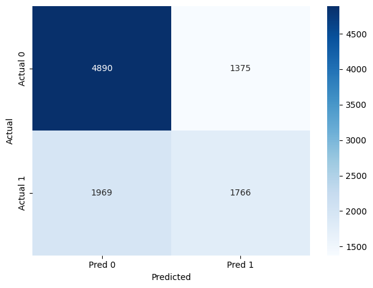

# 🧠 Text Similarity Detector — Quora Duplicate Questions

This project aims to detect whether two questions are duplicates using basic NLP and cosine similarity.

## 📌 Project Overview

Platforms like Quora often need to detect if a new question has already been asked. This project builds a simple pipeline using:

- **SpaCy** for preprocessing (tokenization, lemmatization, stopword removal)
- **TF-IDF** for vectorizing questions
- **Cosine Similarity** for computing pairwise similarity
- **Thresholding** (≥ 0.75) to classify questions as duplicates

## 📊 Dataset

- Dataset: [Quora Question Pairs](https://www.kaggle.com/competitions/quora-question-pairs/data)
- Sample used: 10,000 rows for performance reasons

## ⚙️ Pipeline

1. Preprocessing both questions
2. Vectorizing using `TfidfVectorizer`
3. Computing similarity using `cosine_similarity`
4. Comparing with `is_duplicate` labels

## 📈 Results

- **Accuracy:** 67%
- **F1 (duplicate class):** 0.51
- **Confusion Matrix:**

### Observations

- Non-duplicates are detected better.
- Duplicate recall is lower — room for semantic embeddings or supervised models.

## 🛠️ Tech Used

- Python
- SpaCy (`en_core_web_md`)
- scikit-learn
- Pandas
- Seaborn / Matplotlib

---

Feel free to fork this project and improve it with semantic understanding or BERT embeddings!
